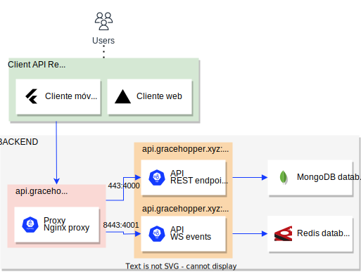
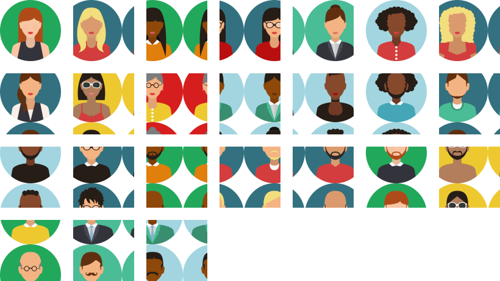

# ChessGame

Welcome to our GitHub organization for the Chess Project team! We are a group of students passionate about software development and are currently working on a project to develop chess software. Our team consists of talented developers and designers who are committed to delivering a high quality product that meets the needs of chess players and enthusiasts based on the requirements set by our client [Rubén Béjar](https://github.com/rbejar).

Our project is being developed as part of our software project class, and we are using GitHub to manage our code, collaborate on development tasks, and track our progress. We believe in open source software and welcome contributions and feedback from the community.

In this organization you will find our code repositories, project documentation, and issue tracker. We encourage you to explore our work and give us feedback on our progress. If you are interested in contributing to our project, please do not hesitate to contact us.

Thank you for your interest in our project and we look forward to sharing our progress with you.

## Architecture

## Assets

### Avatars

#### Memojis

#### Animals

#### Humans

